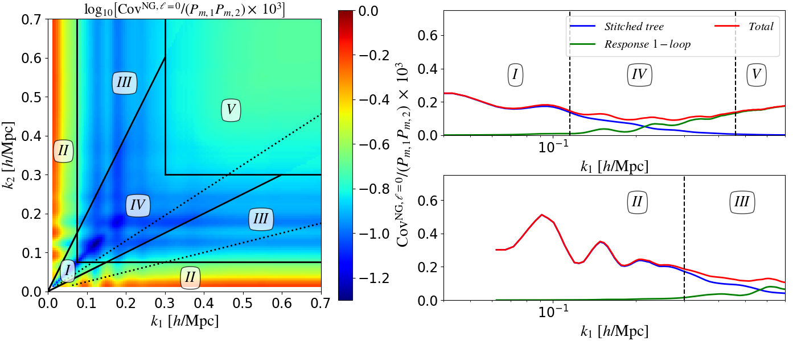
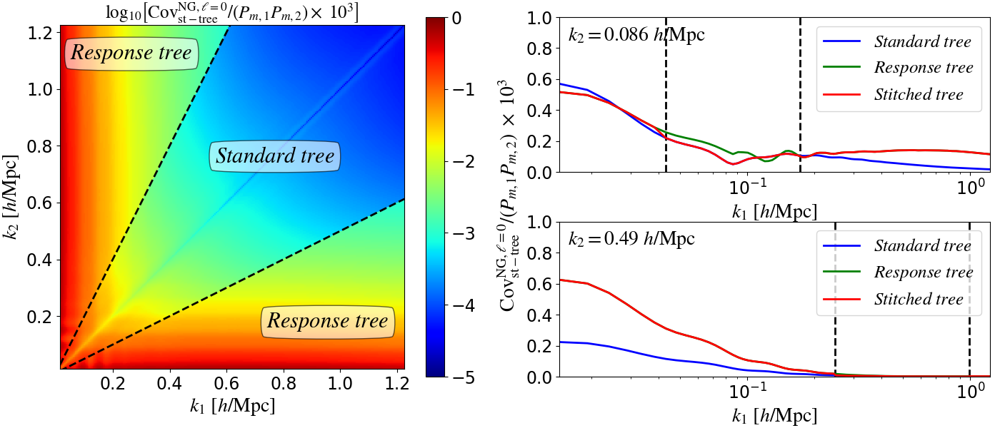
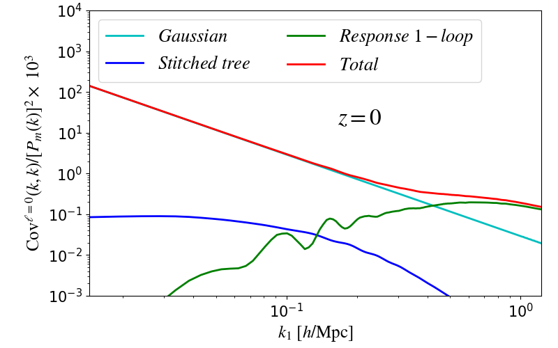
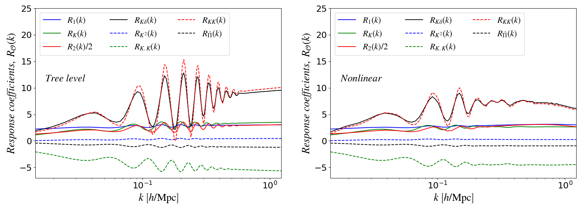

# Covariances with the Response Approach

This code computes the covariance matrix of the matter power spectrum using the response approach to perturbation theory. It was used in the numerical analysis of the papers:

- Barreira & Schmidt 2017a, https://arxiv.org/abs/1703.09212
- Barreira & Schmidt 2017b, https://arxiv.org/abs/1705.01092

who developed the response approach and used it, as a first application, to address the problem of accurate analytical calculations of covariance matrices. This code includes the Gaussian (G) term and the connected non-Gaussian (cNG) term up to 1-loop. For the remaining super-sample covariance term see the code (lensing SSC)[https://github.com/alexmrbarreira/gravitational_lensing_SSC].

For more applications of the response approach see:

- Barreira, Krause & Schmidt 2018, https://arxiv.org/abs/1711.07467
- Barreira 2019, https://arxiv.org/abs/1901.01243
- Barreira et al. 2019, https://arxiv.org/abs/1904.02070
- Halder & Barreira 2022, https://arxiv.org/abs/2201.05607

### Dependencies

- python (numpy, scipy, matplotlib)

### Code overview

- The files parameters.py and functions.py define global parameters, variables and functions
- The scripts in compute_cov/ execute the covariance calculation
- The scripts in plots/ make plots (figures are stored here too).

### Gallery

Summary of the kinematic regimes in $k_1-k_2$ space

Stitching of the tree-level standard perturbation theory (SPT) and response results

Contributions along the diagonal

Response functions used in the calculation

